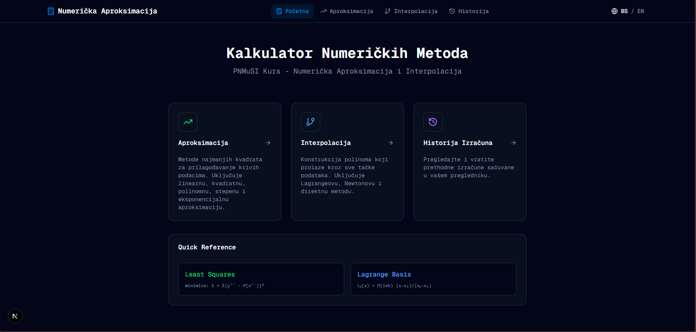
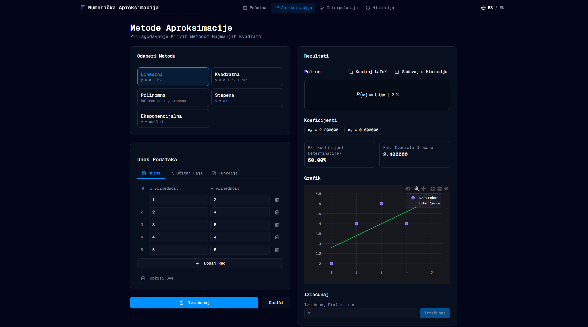
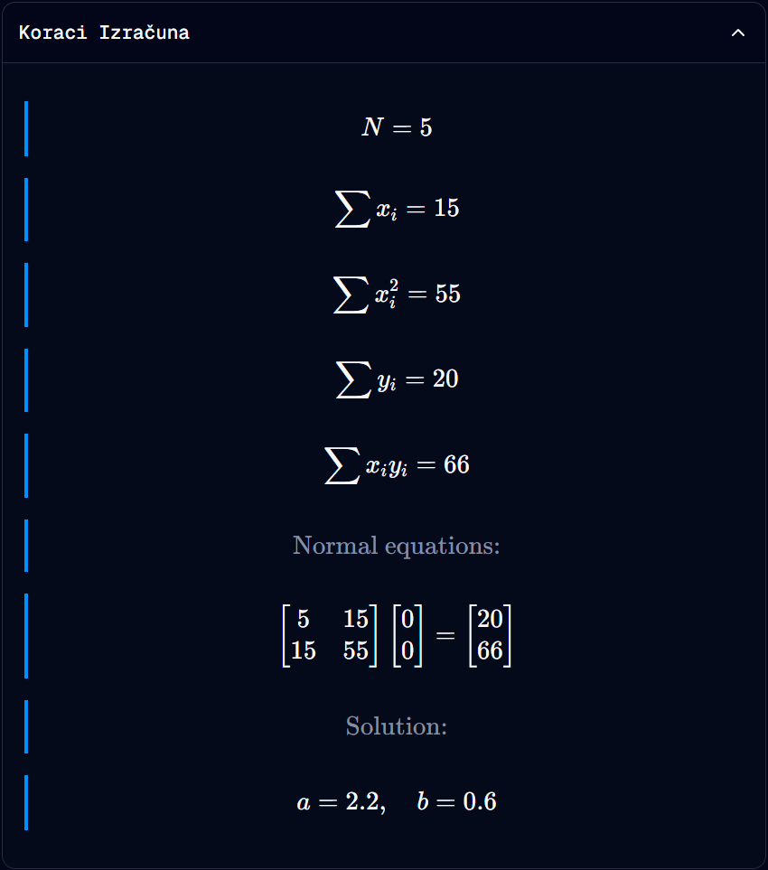

# Numerička Aproksimacija i Interpolacija (PNMuSI)

Ovaj projekat je moderna web aplikacija za numeričku aproksimaciju i interpolaciju funkcija, razvijena u okviru predmeta **Projektovanje i analiza algoritama (PNMuSI)**. Aplikacija omogućava korisnicima da unesu podatke ručno, putem datoteka ili definisanjem funkcija, te izračunaju aproksimacione polinome i interpolacione funkcije uz detaljan prikaz koraka i grafičku vizuelizaciju.

## 🚀 Screenshots


*Glavni meni sa izborom metoda*


*Proces aproksimacije sa Plotly grafikom*


*Detaljan matematički izvod proračuna*

## ✨ Ključne Funkcionalnosti

### 1. Numerička Aproksimacija (Metoda najmanjih kvadrata)
- **Linearna:** y = a + bx
- **Kvadratna:** y = a + bx + cx²
- **Polinomijalna:** Proračun polinoma proizvoljnog stepena `n`.
- **Stepena:** y = axᵇ (koristeći logaritamsku transformaciju).
- **Eksponencijalna:** y = aeᵇˣ (koristeći logaritamsku transformaciju).

### 2. Interpolacija 
> Ovo cemo najvjerovatnije ukiniti kasnije jer nije traženo
- **Lagrangeova metoda:** Konstrukcija polinoma pomoću baznih polinoma.
- **Newtonova metoda:** Korišćenje podijeljenih razlika za efikasnu interpolaciju.
- **Direktna metoda:** Rješavanje sistema linearnih jednačina pomoću Vandermondeove matrice.

### 3. Modovi unosa podataka
- **Ručni unos:** Interaktivna tabela za dodavanje i brisanje tačaka.
- **Unos funkcije:** Definisanje f(x) izraza i automatsko generisanje tačaka u zadatom intervalu.
- **Otpremanje datoteka:** Podrška za CSV (x,y) i JSON formate.

### 4. Napredne mogućnosti
- **MathLive Integracija:** Profesionalni editor za matematičke formule sa virtuelnom tastaturom.
- **Cortex Compute Engine:** Robusna evaluacija matematičkih izraza i LaTeX parsing.
- **Detaljni koraci izračuna:** Prikaz svake faze algoritma (matrice sistema, normalne jednačine, rješenja).
- **Interaktivni grafici:** Zumiranje i detaljan pregled funkcija pomoću Plotly.js biblioteke.
- **Dvojezičnost:** Potpuna podrška za bosanski i engleski jezik.

## 🛠️ Tehnološki Stog

- **Framework:** [Next.js 15](https://nextjs.org/) (App Router, Turbopack)
- **Jezik:** [TypeScript](https://www.typescriptlang.org/)
- **Stilizacija:** [Tailwind CSS 4](https://tailwindcss.com/)
- **Matematika:** [@cortex-js/compute-engine](https://cortexjs.io/compute-engine/), [MathLive](https://mathlive.io/)
- **Vizuelizacija:** [Plotly.js](https://plotly.com/javascript/), [KaTeX](https://katex.org/)
- **UI Komponente:** [Radix UI](https://www.radix-ui.com/), [Lucide Icons](https://lucide.dev/)

## 💻 Postavljanje Projekta (Setup)

Pratite ove korake da biste pokrenuli aplikaciju lokalno:

### Preduslovi
- Instaliran [Node.js](https://nodejs.org/) (verzija 18 ili novija)
- npm (dolazi uz Node.js)

### Instalacija i pokretanje

1. **Klonirajte repozitorij:**
   ```bash
   git clone https://github.com/SafetImamovic/numericka-aproksimacija.git
   cd numericka-aproksimacija/
   ```

2. **Instalirajte zavisnosti:**
   ```bash
   npm install
   ```

3. **Pokrenite razvojni server:**
   ```bash
   npm run dev
   ```

4. **Otvorite aplikaciju u pregledniku:**
   Posjetite [http://localhost:3000](http://localhost:3000).

## 🤝 Doprinos Projektu (Contributing)

Ako ste član tima ili želite doprinijeti projektu:

1. Provjerite `CLAUDE.md` za smjernice o arhitekturi i stilu koda.
2. Sve matematičke algoritme dodajte u `lib/math` direktorij.
3. Nove UI komponente kreirajte u skladu sa postojećim dizajnom u `components/ui`.
4. Sve nove stringove za prevod dodajte u `messages/bs.json` i `messages/en.json`.

---
*Projekat razvijen za potrebe predmeta PNMuSI.*
